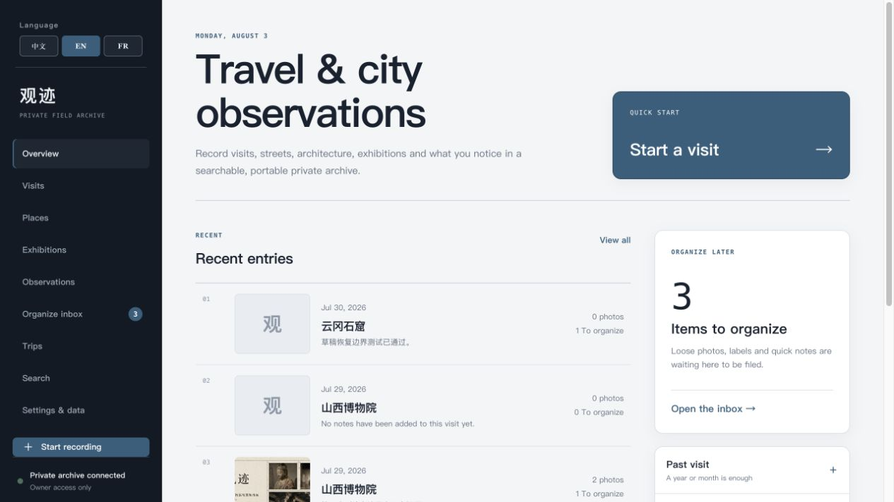

# 观迹 · Travel & City Log

中文 · [English](#english) · [Français](#français)



一个移动端优先、默认私有的旅行、城市、建筑、街景与博物馆观察档案。界面支持中文、英语和法语；第一次打开使用中文，之后会在当前浏览器中记住上次选择的语言。

> 这个项目不依赖 Codex 容器，也不需要 Docker。fork 或 clone 后，可直接使用 Node.js 在普通电脑上运行。

## 功能

- 记录地点、展览、到访、观察对象、旅程、现场速记与照片组。
- 主页足迹地图按国家/地区点亮；中、美、俄、英、法、德、意、日可细化到一级行政区，城市按经纬度显示图钉。
- 手动添加国家、一级行政区或城市；已完成旅程和到访地点会自动补齐足迹并去重。
- 使用标签和全文搜索重新查找记录。
- 原始照片与结构化数据分开保存。
- 导出 JSON、CSV、Markdown 和原始照片。
- 中文、English、Français 三语界面；用户内容、标签和搜索字符不会被翻译或改写。

## Fork 后运行

### 1. 环境要求

- Git
- Node.js `>=22.13.0`（包含 npm）
- 不需要 Docker，也不需要预先创建 Cloudflare 账号或数据库即可本地开发

### 2. Fork、clone 与安装

先在 GitHub 点击 **Fork**，然后运行：

```bash
git clone https://github.com/<你的用户名>/trip-journal.git
cd trip-journal
npm ci
```

### 3. 启动本地开发环境

```bash
npm run dev
```

终端会显示本地地址，通常是 [http://localhost:3000](http://localhost:3000)。开发服务器会通过 Miniflare 在本机模拟 Cloudflare D1 和 R2：

- D1 绑定 `DB`：结构化档案和关系数据
- R2 绑定 `PHOTOS`：用户主动上传的原始照片
- 本地状态存放在被 Git 忽略的 `.wrangler/` 目录

第一次运行会得到独立的本地数据环境。原作者的私人记录和照片不会包含在 GitHub 仓库、fork 或 clone 中。

### 4. 构建与验证

```bash
npm run build
npm test
npx tsc --noEmit
npm run lint
```

`npm test` 会执行生产构建，并验证应用入口、数据库模型、关键归档动作和原始照片存储路径。

### 5. 数据库结构变更

修改 [`db/schema.ts`](db/schema.ts) 后生成迁移：

```bash
npm run db:generate
```

新的迁移文件会写入 `drizzle/`，应与代码一起提交。

## 部署到自己的 Sites 项目

`.openai/hosting.json` 声明以下逻辑资源：

```json
{
  "project_id": "<你的 Sites 项目 ID>",
  "d1": "DB",
  "r2": "PHOTOS"
}
```

当前仓库中的 `project_id` 属于原项目。fork 后部署时，必须在 Codex Sites 中创建自己的项目，并用自己的项目 ID 替换它。不要尝试部署到原作者的项目。

Sites 会为每个项目分别创建和绑定真实的 D1 与 R2 资源，并在部署时执行 `drizzle/` 中的迁移。`.openai/hosting.json` 不包含密钥，但 `.env*`、`.wrangler/`、`dist/` 和上传的数据都不应提交。

## 数据与隐私

- GitHub 仓库只包含应用代码、数据库结构和迁移，不包含用户档案或上传照片。
- 浏览器语言和主题偏好保存在本机 `localStorage`。
- 本地开发数据保存在 `.wrangler/`；删除该目录会清除本地模拟数据。
- 正式部署的数据和照片分别保存在该 Sites 项目自己的 D1 与 R2 中。

## 常用命令

| 命令 | 用途 |
| --- | --- |
| `npm run dev` | 启动本地开发服务器 |
| `npm run build` | 生成生产构建 |
| `npm test` | 构建并运行测试 |
| `npm run lint` | 检查代码 |
| `npx tsc --noEmit` | 检查 TypeScript 类型 |
| `npm run db:generate` | 根据 schema 生成数据库迁移 |

---

## English

A mobile-first, private-by-default archive for travel, cities, architecture, street scenes, and museum observations. The interface supports Chinese, English, and French. It opens in Chinese the first time and then remembers the last language selected in that browser.

> This project does not depend on the Codex container and does not require Docker. After forking or cloning it, you can run it on a regular computer with Node.js.

### Features

- Record places, exhibitions, visits, observed objects, trips, field notes, and photo groups.
- Light up countries and territories on the homepage map. China, the US, Russia, the UK, France, Germany, Italy, and Japan support first-level administrative detail; cities appear as coordinate-based pins.
- Add country, region, or city footprints manually. Completed trips and visited places fill missing footprints automatically without duplicates.
- Rediscover entries with tags and full-text search.
- Keep original photos separate from structured archive data.
- Export JSON, CSV, Markdown, and original photos.
- Chinese, English, and French UI without translating or rewriting user content, tags, or search text.

### Run a fork locally

#### 1. Requirements

- Git
- Node.js `>=22.13.0` with npm
- No Docker, Cloudflare account, or pre-created database is required for local development

#### 2. Fork, clone, and install

Click **Fork** on GitHub, then run:

```bash
git clone https://github.com/<your-username>/trip-journal.git
cd trip-journal
npm ci
```

#### 3. Start development

```bash
npm run dev
```

The terminal prints the local URL, usually [http://localhost:3000](http://localhost:3000). The development server uses Miniflare to emulate Cloudflare D1 and R2 locally:

- D1 binding `DB`: structured archive records and relationships
- R2 binding `PHOTOS`: original photos explicitly uploaded by the user
- Local state: the Git-ignored `.wrangler/` directory

Every fresh checkout starts with an independent local data environment. The original owner's private records and photos are not included in the GitHub repository, forks, or clones.

#### 4. Build and validate

```bash
npm run build
npm test
npx tsc --noEmit
npm run lint
```

`npm test` performs a production build and verifies the application entry point, database model, core archive actions, and original-photo storage path.

#### 5. Change the database schema

After editing [`db/schema.ts`](db/schema.ts), generate a migration:

```bash
npm run db:generate
```

The generated migration is written to `drizzle/` and should be committed with the code.

### Deploy to your own Sites project

`.openai/hosting.json` declares the logical resources:

```json
{
  "project_id": "<your Sites project ID>",
  "d1": "DB",
  "r2": "PHOTOS"
}
```

The `project_id` currently in the repository belongs to the original project. Before deploying a fork, create your own project with Codex Sites and replace it with your own project ID. Do not attempt to deploy to the original owner's project.

Sites provisions separate D1 and R2 resources for each project and runs the migrations in `drizzle/` during deployment. `.openai/hosting.json` contains no secret, but `.env*`, `.wrangler/`, `dist/`, and uploaded data must not be committed.

### Data and privacy

- The GitHub repository contains only application code, the database schema, and migrations—never user archives or uploaded photos.
- Browser language and theme preferences are stored in local `localStorage`.
- Local development data lives in `.wrangler/`; deleting it clears the local emulated data.
- Production records and photos live in that Sites project's own D1 and R2 resources.

### Commands

| Command | Purpose |
| --- | --- |
| `npm run dev` | Start the local development server |
| `npm run build` | Create a production build |
| `npm test` | Build and run tests |
| `npm run lint` | Check the code |
| `npx tsc --noEmit` | Run TypeScript type checking |
| `npm run db:generate` | Generate a database migration from the schema |

---

## Français

Une archive privée par défaut, pensée d'abord pour le mobile, destinée aux voyages, aux villes, à l'architecture, aux scènes de rue et aux observations de musée. L'interface est disponible en chinois, en anglais et en français. Elle s'ouvre en chinois lors de la première visite, puis mémorise la dernière langue choisie dans le navigateur.

> Ce projet ne dépend pas du conteneur Codex et ne nécessite pas Docker. Après un fork ou un clone, il fonctionne sur un ordinateur ordinaire avec Node.js.

### Fonctionnalités

- Enregistrer lieux, expositions, visites, objets observés, voyages, notes de terrain et groupes de photos.
- Éclairer les pays et territoires sur la carte d’accueil. La Chine, les États-Unis, la Russie, le Royaume-Uni, la France, l’Allemagne, l’Italie et le Japon disposent d’un détail administratif de premier niveau ; les villes apparaissent selon leurs coordonnées.
- Ajouter manuellement un pays, une région ou une ville. Les voyages terminés et les lieux visités complètent automatiquement les traces sans doublons.
- Retrouver les entrées grâce aux étiquettes et à la recherche en texte intégral.
- Conserver les photos originales séparément des données structurées.
- Exporter JSON, CSV, Markdown et les photos originales.
- Interface en chinois, anglais et français sans traduire ni modifier le contenu utilisateur, les étiquettes ou le texte recherché.

### Exécuter un fork en local

#### 1. Prérequis

- Git
- Node.js `>=22.13.0` avec npm
- Aucun Docker, compte Cloudflare ou base de données préexistante n'est nécessaire pour le développement local

#### 2. Fork, clone et installation

Cliquez sur **Fork** dans GitHub, puis exécutez :

```bash
git clone https://github.com/<votre-nom-utilisateur>/trip-journal.git
cd trip-journal
npm ci
```

#### 3. Démarrer le développement

```bash
npm run dev
```

Le terminal affiche l'adresse locale, généralement [http://localhost:3000](http://localhost:3000). Le serveur de développement utilise Miniflare pour simuler Cloudflare D1 et R2 en local :

- liaison D1 `DB` : archives structurées et relations
- liaison R2 `PHOTOS` : photos originales envoyées explicitement par l'utilisateur
- état local : dossier `.wrangler/`, ignoré par Git

Chaque nouveau checkout dispose d'un environnement de données local indépendant. Les archives privées et les photos du propriétaire d'origine ne sont incluses ni dans le dépôt GitHub, ni dans les forks, ni dans les clones.

#### 4. Construire et vérifier

```bash
npm run build
npm test
npx tsc --noEmit
npm run lint
```

`npm test` effectue une construction de production et vérifie le point d'entrée de l'application, le modèle de données, les principales actions d'archivage et le stockage des photos originales.

#### 5. Modifier le schéma de données

Après avoir modifié [`db/schema.ts`](db/schema.ts), générez une migration :

```bash
npm run db:generate
```

La migration est écrite dans `drizzle/` et doit être commitée avec le code.

### Déployer vers votre propre projet Sites

`.openai/hosting.json` déclare les ressources logiques :

```json
{
  "project_id": "<identifiant de votre projet Sites>",
  "d1": "DB",
  "r2": "PHOTOS"
}
```

Le `project_id` présent dans le dépôt appartient au projet d'origine. Avant de déployer un fork, créez votre propre projet avec Codex Sites et remplacez cette valeur par l'identifiant de votre projet. N'essayez pas de déployer vers le projet du propriétaire d'origine.

Sites crée des ressources D1 et R2 distinctes pour chaque projet et exécute les migrations de `drizzle/` pendant le déploiement. `.openai/hosting.json` ne contient aucun secret, mais `.env*`, `.wrangler/`, `dist/` et les données envoyées ne doivent pas être commités.

### Données et confidentialité

- Le dépôt GitHub ne contient que le code, le schéma de données et les migrations — jamais les archives utilisateur ni les photos envoyées.
- Les préférences de langue et de thème sont conservées dans le `localStorage` du navigateur.
- Les données de développement locales sont dans `.wrangler/` ; supprimer ce dossier efface les données simulées locales.
- En production, les enregistrements et les photos se trouvent dans les ressources D1 et R2 propres au projet Sites concerné.

### Commandes

| Commande | Utilisation |
| --- | --- |
| `npm run dev` | Démarrer le serveur de développement local |
| `npm run build` | Créer une version de production |
| `npm test` | Construire et exécuter les tests |
| `npm run lint` | Vérifier le code |
| `npx tsc --noEmit` | Vérifier les types TypeScript |
| `npm run db:generate` | Générer une migration depuis le schéma |
